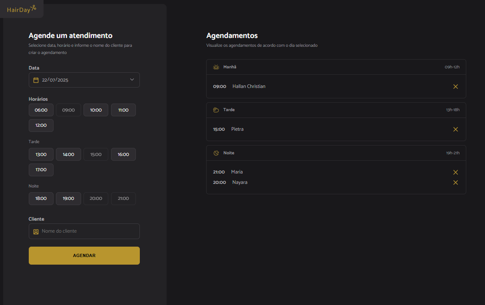

# Hair Day - Projeto de Agendamentos

Hair Day - Projeto Agendamentos é um aplicativo web que exibe agendamentos diários organizados por período (manhã, tarde e noite).



## Visão Geral

O Hair Day - Projeto Agendamentos é uma aplicação moderna e responsiva que exibe, de forma clara e visualmente agradável, os horários agendados de acordo com o período do dia. Os dados são processados e exibidos dinamicamente usando JavaScript e a biblioteca `dayjs`, com uma interface amigável baseada em HTML5 e CSS3.

## Tecnologias Utilizadas

- **JavaScript (ES6+)**: Manipulação dinâmica de elementos DOM, lógica de renderização e uso da biblioteca `dayjs` para manipulação de datas.
- **HTML5**: Estrutura semântica da página.
- **CSS3**: Estilização da interface com suporte a layout responsivo.
- **Day.js**: Biblioteca leve para lidar com datas e horários.
- **Webpack**: Empacotador de módulos para gerar os arquivos finais otimizados.
- **Babel**: Transpilador que converte código moderno em versões compatíveis com mais navegadores.

## Funcionalidades

1. **Exibição de agendamentos diários**: Lista de horários organizados em três períodos do dia.
2. **Organização automática por horário**:
   - Manhã: 08h às 12h
   - Tarde: 12h às 18h
   - Noite: após 18h
3. **Renderização dinâmica**: Os agendamentos são renderizados dinamicamente com ícones de cancelamento.
4. **Formato de horário**: Os horários são exibidos no formato `HH:mm`.
5. **Design intuitivo**: Ícones visuais representam cada parte do dia.

## Como Executar o Projeto

1. Extraia os arquivos do zip.

2. Abra o `index.html` no navegador:
   - Clique duas vezes no arquivo `index.html`, ou:
     ```bash
     open index.html
     ```
   - Opcionalmente, rode um servidor HTTP local:
     ```bash
     npx http-server
     # Acesse http://localhost:8080
     ```

## Exemplos de Uso

- Ao acessar a página, os agendamentos do dia selecionado são organizados por período.
- Cada item mostra o horário e o nome do agendado, com um botão de cancelamento representado por um ícone.
- Totalmente responsivo e fácil de usar.

## Ver Projeto

Link do projeto publicado aqui:  
https://hairday.hallanchristian.com.br
